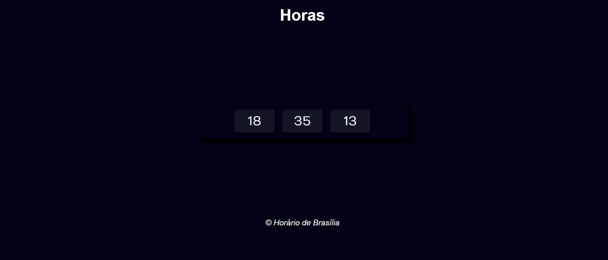

# Relógio Digital com JavaScript

Um relógio digital desenvolvido com HTML, CSS e JavaScript, capaz de exibir e atualizar a hora atual em tempo real diretamente no navegador.

<p align="center">
  
</p>

## Tecnologias


## Funcionalidades

- Exibição da hora atual.
- Atualização automática do horário em tempo real.
- Interface simples e intuitiva.
- Estilização utilizando CSS.
- Funcionamento diretamente no navegador.

## Estrutura do Projeto

```text
Relogio-com-JS/
├── index.html
├── style.css
├── script.js
└── README.md
```
## Demonstração

Acesse o projeto publicado:

[**Visualizar o Relógio Digital**](https://anacrisbrito.github.io/Relogio-com-JS/)
